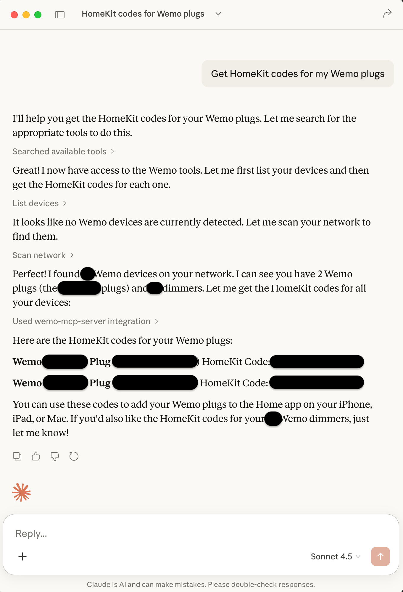

# WeMo MCP Server

Control WeMo smart home devices through AI assistants using natural language.

[](#claude-desktop-integration)
[](#claude-code-cli)
[](#vs-code-integration)
[](cursor://anysphere.cursor-deeplink/mcp/install?name=WeMo%20MCP%20Server&config=eyJjb21tYW5kIjoidXZ4IiwiYXJncyI6WyJ3ZW1vLW1jcC1zZXJ2ZXIiXX0%3D)

[](https://pypi.org/project/wemo-mcp-server/)
[](https://www.python.org/downloads/)
[](https://opensource.org/licenses/MIT)
[](https://modelcontextprotocol.io)

## Quick Start

Install this package:

```bash
pip install wemo-mcp-server
```

or use [uvx](https://docs.astral.sh/uv/) for isolated execution:

```bash
uvx wemo-mcp-server
```

Then click one of the badges above to add to your MCP client, or see [Configuration](#configuration) for manual setup.

## Overview

This MCP server provides seamless integration with WeMo smart home devices, enabling discovery, monitoring, and control through the Model Context Protocol. Built on the proven [pywemo](https://github.com/pywemo/pywemo) library, it offers reliable device management with intelligent multi-phase discovery.

### Example: Controlling Devices with Claude



*Natural language control of WeMo devices through Claude Desktop - just ask in plain English and the MCP server handles the rest.*

## Features

- **🔍 Smart Discovery**: Multi-phase device discovery combining UPnP/SSDP multicast and network scanning
- **⚡ Fast Scanning**: Parallel network probing with configurable concurrency (23-30s for full subnet)
- **🎛️ Device Control**: Turn devices on/off, toggle state, and control brightness for dimmers
- **✏️ Device Management**: Rename devices and extract HomeKit setup codes
- **📊 Status Monitoring**: Real-time device state and brightness queries
- **💾 Device Caching**: Automatic caching of discovered devices for quick access
- **🔌 MCP Integration**: Works with any MCP-compatible application (Claude Desktop, VS Code, etc.)

## Configuration

### Claude Desktop

Edit `~/Library/Application Support/Claude/claude_desktop_config.json`:

```json
{
  "mcpServers": {
    "wemo-mcp-server": {
      "command": "uvx",
      "args": ["wemo-mcp-server"]
    }
  }
}
```

### Claude Code CLI

```bash
claude mcp add wemo-mcp-server --command uvx --args wemo-mcp-server
```

### VS Code

Edit `~/.vscode/mcp.json`:

```json
{
  "servers": {
    "wemo-mcp-server": {
      "type": "stdio",
      "command": "uvx",
      "args": ["wemo-mcp-server"]
    }
  }
}
```

### Cursor

Click the "Add to Cursor" badge above, or edit `~/.cursor/mcp.json`:

```json
{
  "servers": {
    "wemo-mcp-server": {
      "type": "stdio",
      "command": "uvx",
      "args": ["wemo-mcp-server"]
    }
  }
}
```

## Available Tools

### 1. scan_network

Discover WeMo devices on your network using intelligent multi-phase scanning.

**Example Prompts:**
- "Scan for WeMo devices on my network"
- "Find all WeMo devices"
- "Discover devices on 192.168.1.0/24"

**Example Response:**
```
Found 12 WeMo devices in 23.5 seconds:

1. Office Light (Dimmer) - 192.168.1.100 - OFF
2. Living Room (Switch) - 192.168.1.101 - ON
3. Bedroom Lamp (Dimmer) - 192.168.1.102 - OFF  
...
```

### 2. list_devices

List all devices cached from previous scans.

**Example Prompts:**
- "List all my WeMo devices"
- "Show me all devices"
- "What devices do you know about?"

**Example Response:**
```
12 devices in cache:

- Office Light (Dimmer) at 192.168.1.100
- Living Room (Switch) at 192.168.1.101
- Bedroom Lamp (Dimmer) at 192.168.1.102
...
```

### 3. get_device_status

Get current state and information for a specific device.

**Example Prompts:**
- "Is the office light on?"
- "What's the status of the bedroom lamp?"
- "Check the living room switch"
- "What's the brightness of office light?"

**Example Response:**
```
Office Light (Dimmer):
- State: OFF
- Brightness: 75%
- IP: 192.168.1.100
- Model: DimmerLongPress
```

### 4. control_device

Control a WeMo device (on/off/toggle/brightness).

**Example Prompts:**
- "Turn on the office light"
- "Turn off the living room"
- "Toggle the bedroom lamp"
- "Set office light to 75%"
- "Dim the bedroom lamp to 50%"

**Example Response:**
```
✓ Office Light turned ON
  Brightness set to 75%
  Current state: ON
```

### 5. rename_device

Rename a WeMo device (change its friendly name).

**Example Prompts:**
- "Rename Office Dimmer to Office Light"
- "Change the name of the bedroom device to Bedroom Lamp"
- "Call the living room switch 'Main Light'"

**Example Response:**
```
✓ Device renamed successfully
  'Office Dimmer' → 'Office Light'
  IP: 192.168.1.100
  
The new name will appear in the WeMo app and all control interfaces.
```

### 6. get_homekit_code

Get the HomeKit setup code for a WeMo device.

**Example Prompts:**
- "Get the HomeKit code for Office Light"
- "What's the HomeKit setup code for the bedroom lamp?"
- "Show me the HomeKit code for all devices"

**Example Response:**
```
HomeKit Setup Code for 'Office Light':
  123-45-678
  
Use this code to add the device to Apple Home.
```

**Note:** Not all WeMo devices support HomeKit. If a device doesn't support HomeKit, you'll get an error message.

## How It Works

### Multi-Phase Discovery

The server uses a three-phase discovery process optimized for reliability:

1. **Phase 1 - UPnP/SSDP Discovery (Primary)**
   - Multicast discovery finds all responsive devices (~12s)
   - Most reliable method, finds devices that don't respond to port probes
   - Uses pywemo's built-in discovery mechanism

2. **Phase 2 - Network Port Scanning (Backup)**
   - Parallel probing of WeMo ports (49152-49155) across subnet
   - 60 concurrent workers for fast scanning (~10s for 254 IPs)
   - Catches devices missed by UPnP

3. **Phase 3 - Device Verification (Backup)**
   - HTTP verification of active IPs via /setup.xml
   - Parallel verification with 60 workers
   - Validates and extracts device information

This approach achieves **100% device discovery reliability** while maintaining fast scan times (23-30 seconds for complete networks).

## Feature Comparison

### MCP Server vs wemo-ops-center

Comparison of features between this MCP server and the main [wemo-ops-center](https://github.com/qrussell/wemo-ops-center) project:

| Feature | wemo-ops-center | MCP Server | Notes |
|---------|-----------------|------------|-------|
| **Device Discovery** | ✅ UPnP + Port Scan | ✅ Implemented | Multi-phase discovery with 100% reliability |
| **Device Control** | ✅ On/Off/Toggle | ✅ Implemented | Includes brightness control for dimmers |
| **Device Status** | ✅ Real-time | ✅ Implemented | Query by name or IP address |
| **Device Rename** | ✅ Friendly names | ✅ Implemented | Updates device cache automatically |
| **HomeKit Codes** | ✅ Extract codes | ✅ Implemented | For HomeKit-compatible devices |
| **Multi-subnet** | ✅ VLAN support | ❌ Planned | Currently single subnet per scan |
| **WiFi Provisioning** | ✅ Smart setup | ❌ Not planned | Requires PC WiFi connection changes |
| **Scheduling** | ✅ Time + Solar | ❌ Not planned | Requires persistent daemon (incompatible with MCP model) |
| **Maintenance Tools** | ✅ Resets | ❌ Not planned | Factory reset, clear WiFi, clear data |
| **Profile Management** | ✅ Save/Load | ❌ Not planned | WiFi credential profiles for bulk setup |
| **User Interface** | ✅ GUI + Web | ❌ N/A | MCP uses AI assistant interface |

**Legend:**
- ✅ **Implemented** - Feature is available
- ❌ **Not planned** - Feature conflicts with MCP architecture or use case
- ❌ **Planned** - Feature could be added in future

**Why some features aren't planned for MCP:**
- **Scheduling**: Requires 24/7 background daemon polling. MCP servers are typically invoked on-demand by AI assistants, not run as persistent services.
- **WiFi Provisioning**: Requires changing the host PC's WiFi connection to device setup networks, which is disruptive and platform-specific.
- **Maintenance Tools**: Destructive operations (factory reset, etc.) better suited for dedicated GUI with confirmation dialogs.

**Current MCP Coverage:** 5 of 11 core features (45%) - focused on device discovery, monitoring, and control use cases that fit the MCP model.

## Development

### Setup

```bash
git clone https://github.com/qrussell/wemo-ops-center.git
cd wemo-ops-center/mcp
uv venv
source .venv/bin/activate  # On Windows: .venv\Scripts\activate
uv sync --dev
```

### Running Tests

```bash
# E2E tests (requires WeMo devices on network)
python tests/test_e2e.py

# Unit tests
pytest tests/test_server.py -v
```

### Using Development Version

In your MCP client config, use:
```json
{
  "command": "python",
  "args": ["-m", "wemo_mcp_server"],
  "env": {
    "PYTHONPATH": "/path/to/mcp/src"
  }
}
```

## Contributing

Contributions welcome! Please:

1. Fork the repository
2. Create a feature branch (`git checkout -b feature/amazing-feature`)
3. Make your changes with tests
4. Run the test suite (`python tests/test_e2e.py`)
5. Commit your changes (`git commit -m 'Add amazing feature'`)
6. Push to the branch (`git push origin feature/amazing-feature`)
7. Open a Pull Request

## License

MIT License - see [LICENSE](LICENSE) file for details.

## Acknowledgments

- Built with [Model Context Protocol SDK](https://github.com/modelcontextprotocol/python-sdk)
- Uses [pywemo](https://github.com/pywemo/pywemo) for WeMo device communication
- Part of the [wemo-ops-center](https://github.com/qrussell/wemo-ops-center) project
